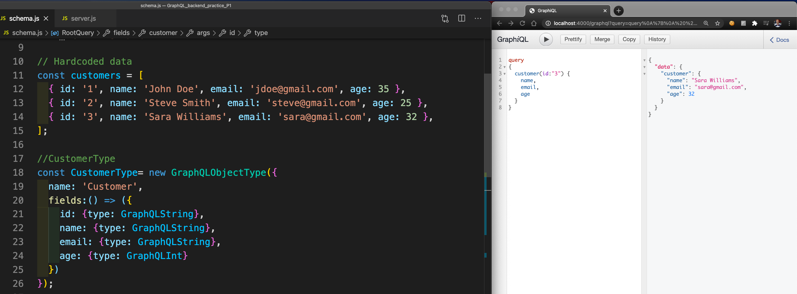
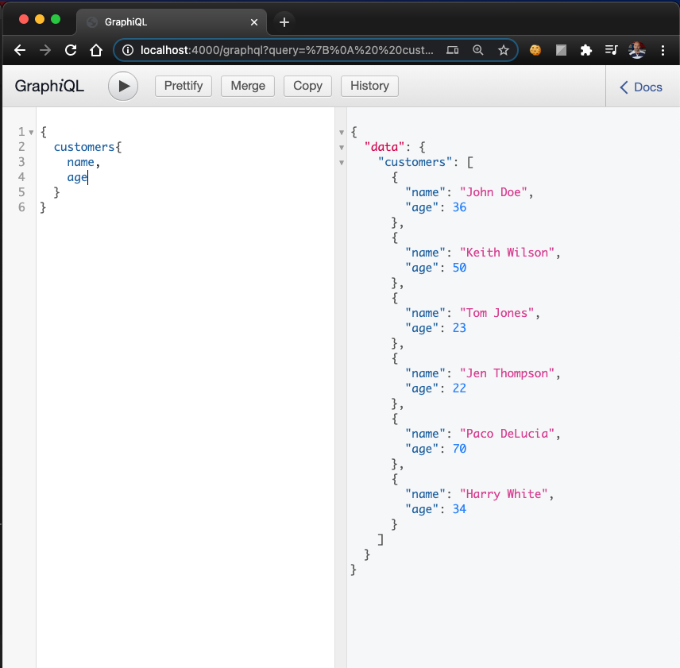
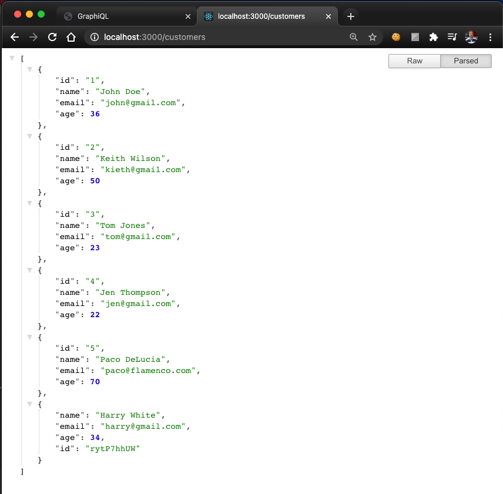
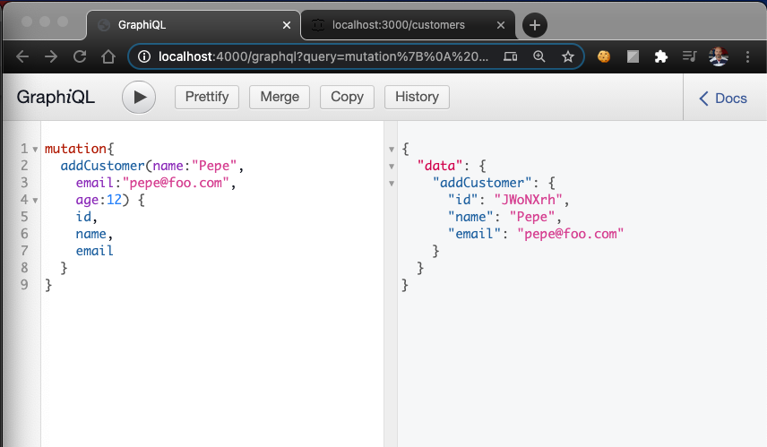
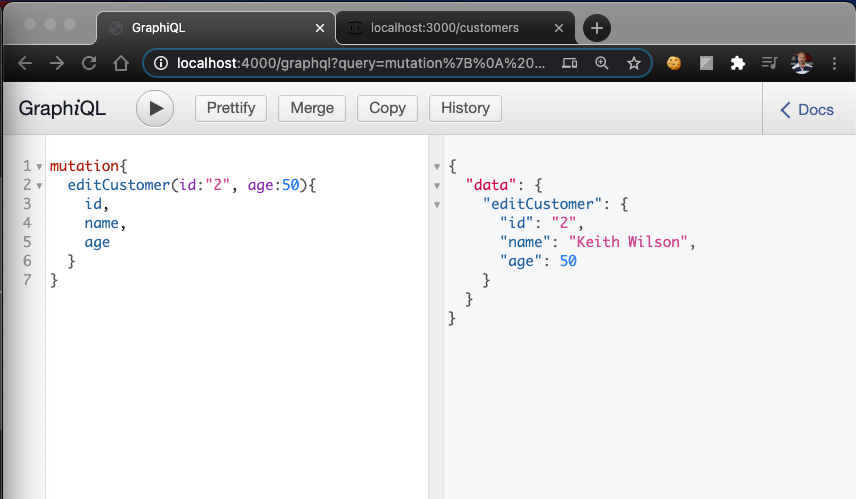
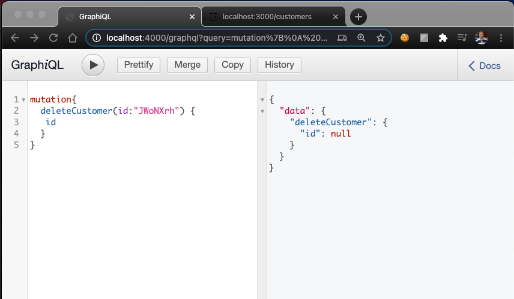

# GraphQL-Node.js-express Exercise

Practice following ["Build A GraphQL Server" - playlist](https://www.youtube.com/playlist?list=PLillGF-RfqbYZty73_PHBqKRDnv7ikh68) by [Traversy Media](https://www.youtube.com/channel/UC29ju8bIPH5as8OGnQzwJyA)

## Prerequisites

Must have node.js installed

## Installation

1. Create folder

2. Open terminal inside the folder

3. Run `$ npm init`

    - Return
    - Return
    - Description: simple GraphQL server
    - entry point: sever.js
    - Return
    - Return
    - Return
    - author: Nico Rithner
    - license: MIT   // free for people to use
    -  yes

4. Install dependencies

    - Install express, express-graphql, graphql, and nodemon:

      `$ npm install express express-graphql  graphql nodemon  --save`

    - Install json-server and axis

      `$ npm install json-server axios --save`


5. Touch server.js in the main directory, in my case with VSCode `$ code server.js` 

```Javascript	
const express = require(‘express’);
const app = express ();

app.listen(4000, () => {
  console.log('Sever is running on port 4000...');
});
```

6. In package.json  in the scripts block remove current text and add

```json
“dev:server: “nodemon server.js”
```

7. Test it out in the terminal

    Run `$ npm run json-server`

    Then view JSON Server in localhost:3000

    Run `$ npm run dev:server`

    Then view in Graphical in localhost:4000

    **Run queries in Graphiql(localhost:4000)**

<p>
  <hr/>
</p>

## Sample Code

<p align="center">
  <br/>
  <small>Sample Query and Code</small>
</p>

<p align="center">
  <br/>
  <small>Sample Customers Query Graphiql</small>
</p>

<p align="center">
  <br/>
  <small>Sample Customers view JSON Server</small>
</p>
<p align="center">
  <br/>
  <small>Sample Add Customer Mutation</small>
</p>
<p align="center">
  <br/>
  <small>Sample Edit Customer Mutation</small>
</p>
<p align="center">
  <br/>
  <small>Sample Delete Customer Mutation</small>
</p>